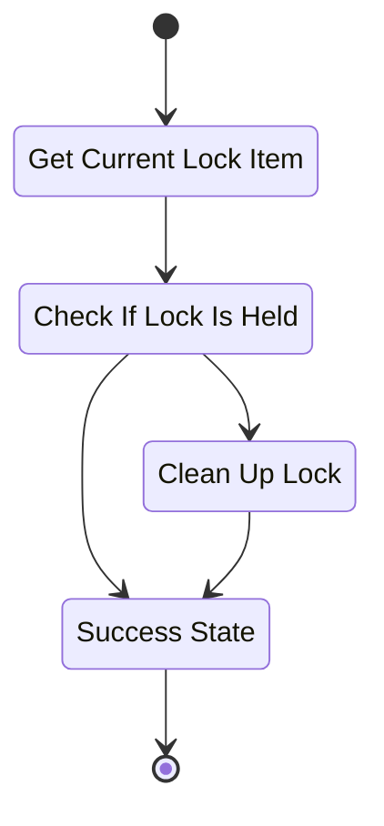

```mermaid
stateDiagram-v2
  state_1: Get Current Lock Item
  state_2: Check If Lock Is Held
  state_3: Clean Up Lock
  state_4: Success State

  [*] --> state_1
  state_1 --> state_2
  state_2 --> state_3
  state_2 --> state_4
  state_3 --> state_4
  state_4 --> [*]
```
