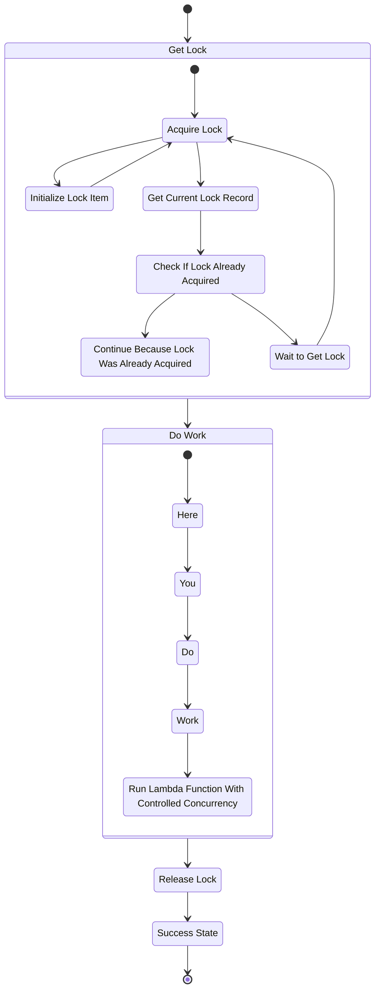

```mermaid
stateDiagram-v2
  state_1: Get Lock
  state_1_1: Acquire Lock
  state_1_2: Initialize Lock Item
  state_1_3: Get Current Lock Record
  state_1_4: Check If Lock Already Acquired
  state_1_5: Continue Because Lock Was Already Acquired
  state_1_6: Wait to Get Lock
  state_2: Do Work
  state_2_1: Here
  state_2_2: You
  state_2_3: Do
  state_2_4: Work
  state_2_5: Run Lambda Function With Controlled Concurrency
  state_3: Release Lock
  state_4: Success State

  state state_1 {
    [*] --> state_1_1
    state_1_1 --> state_1_2
    state_1_1 --> state_1_3
    state_1_2 --> state_1_1
    state_1_3 --> state_1_4
    state_1_4 --> state_1_5
    state_1_4 --> state_1_6
    state_1_6 --> state_1_1
  }
  state state_2 {
    [*] --> state_2_1
    state_2_1 --> state_2_2
    state_2_2 --> state_2_3
    state_2_3 --> state_2_4
    state_2_4 --> state_2_5
  }
  [*] --> state_1
  state_1 --> state_2
  state_2 --> state_3
  state_3 --> state_4
  state_4 --> [*]
```
