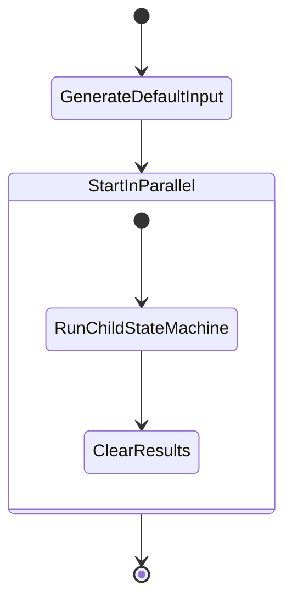

```mermaid
stateDiagram-v2
  state_1: GenerateDefaultInput
  state_2: StartInParallel
  state_2_1: RunChildStateMachine
  state_2_2: ClearResults

  state state_2 {
    [*] --> state_2_1
    state_2_1 --> state_2_2
  }
  [*] --> state_1
  state_1 --> state_2
  state_2 --> [*]
```
