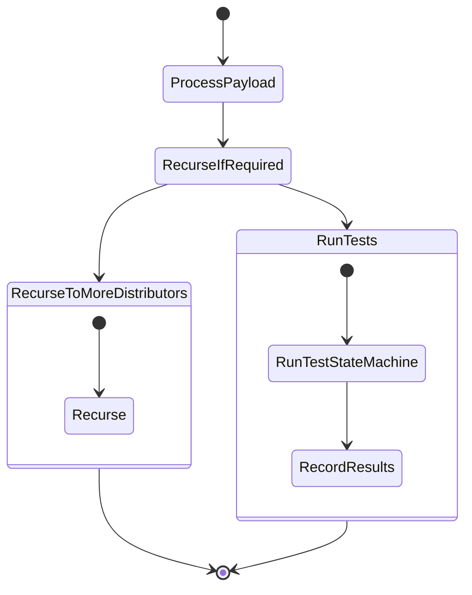

```mermaid
stateDiagram-v2
  state_1: ProcessPayload
  state_2: RecurseIfRequired
  state_3: RecurseToMoreDistributors
  state_3_1: Recurse
  state_4: RunTests
  state_4_1: RunTestStateMachine
  state_4_2: RecordResults

  state state_3 {
    [*] --> state_3_1
  }
  state state_4 {
    [*] --> state_4_1
    state_4_1 --> state_4_2
  }
  [*] --> state_1
  state_1 --> state_2
  state_2 --> state_3
  state_2 --> state_4
  state_3 --> [*]
  state_4 --> [*]
```
