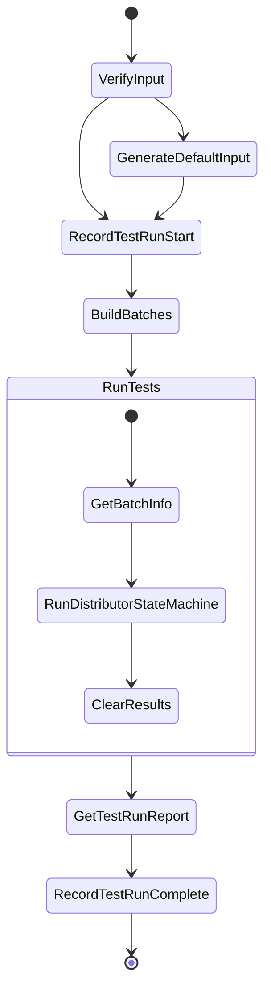

```mermaid
stateDiagram-v2
  state_1: VerifyInput
  state_2: RecordTestRunStart
  state_3: GenerateDefaultInput
  state_4: BuildBatches
  state_5: RunTests
  state_5_1: GetBatchInfo
  state_5_2: RunDistributorStateMachine
  state_5_3: ClearResults
  state_6: GetTestRunReport
  state_7: RecordTestRunComplete

  state state_5 {
    [*] --> state_5_1
    state_5_1 --> state_5_2
    state_5_2 --> state_5_3
  }
  [*] --> state_1
  state_1 --> state_2
  state_1 --> state_3
  state_2 --> state_4
  state_3 --> state_2
  state_4 --> state_5
  state_5 --> state_6
  state_6 --> state_7
  state_7 --> [*]
```
