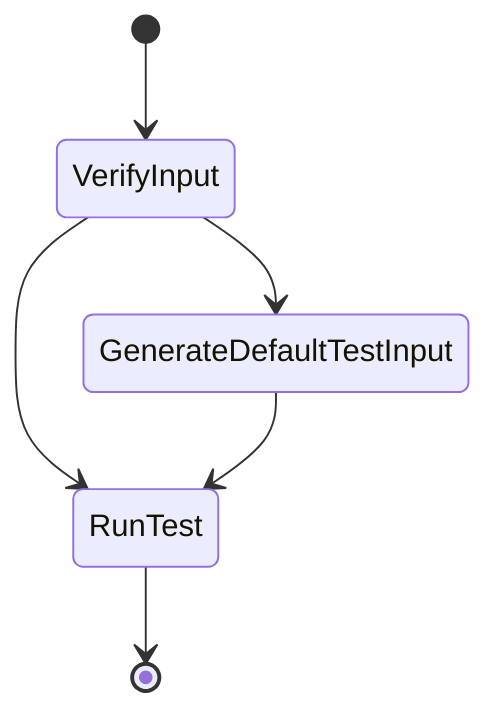

```mermaid
stateDiagram-v2
  state_1: VerifyInput
  state_2: GenerateDefaultTestInput
  state_3: RunTest

  [*] --> state_1
  state_1 --> state_3
  state_1 --> state_2
  state_2 --> state_3
  state_3 --> [*]
```
