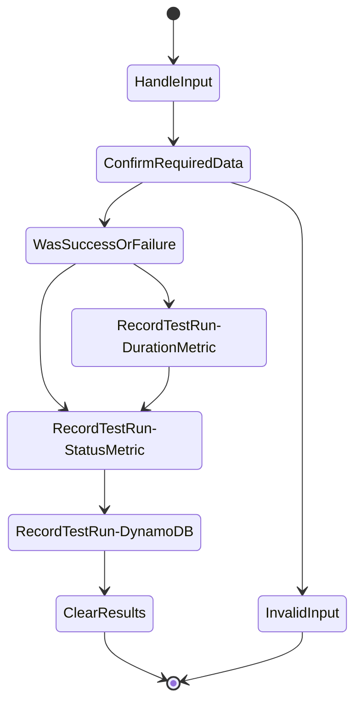

```mermaid
stateDiagram-v2
  state_1: HandleInput
  state_2: ConfirmRequiredData
  state_3: WasSuccessOrFailure
  state_4: RecordTestRun-DurationMetric
  state_5: RecordTestRun-StatusMetric
  state_6: RecordTestRun-DynamoDB
  state_7: ClearResults
  state_8: InvalidInput

  [*] --> state_1
  state_1 --> state_2
  state_2 --> state_3
  state_2 --> state_8
  state_3 --> state_4
  state_3 --> state_5
  state_4 --> state_5
  state_5 --> state_6
  state_6 --> state_7
  state_7 --> [*]
  state_8 --> [*]
```
