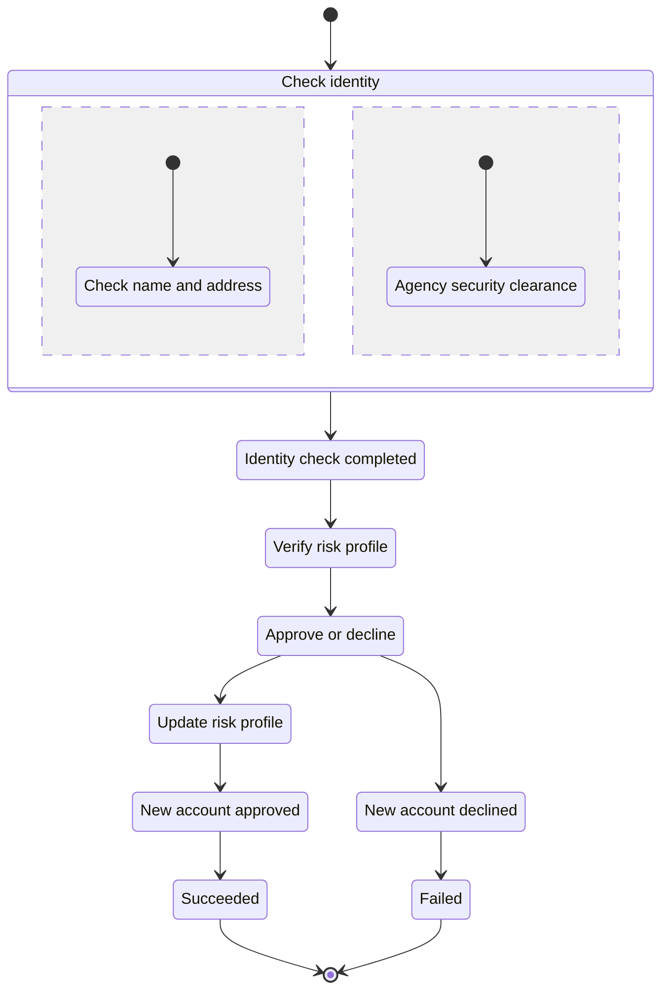

```mermaid
stateDiagram-v2
  state_1: Check identity
  state_1_0_1: Check name and address
  state_1_1_1: Agency security clearance
  state_2: Identity check completed
  state_3: Verify risk profile
  state_4: Approve or decline
  state_5: Update risk profile
  state_6: New account approved
  state_7: New account declined
  state_8: Succeeded
  state_9: Failed

  state state_1 {
    [*] --> state_1_0_1
    --
    [*] --> state_1_1_1
  }
  [*] --> state_1
  state_1 --> state_2
  state_2 --> state_3
  state_3 --> state_4
  state_4 --> state_5
  state_4 --> state_7
  state_5 --> state_6
  state_6 --> state_8
  state_7 --> state_9
  state_8 --> [*]
  state_9 --> [*]
```
