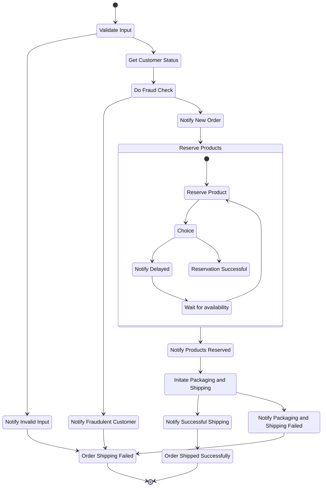

```mermaid
stateDiagram-v2
  state_1: Validate Input
  state_2: Get Customer Status
  state_3: Do Fraud Check
  state_4: Notify New Order
  state_5: Reserve Products
  state_5_1: Reserve Product
  state_5_2: Choice
  state_5_3: Reservation Successful
  state_5_4: Notify Delayed
  state_5_5: Wait for availability
  state_6: Notify Products Reserved
  state_7: Initate Packaging and Shipping
  state_8: Notify Successful Shipping
  state_9: Notify Packaging and Shipping Failed
  state_10: Notify Fraudulent Customer
  state_11: Order Shipping Failed
  state_12: Order Shipped Successfully
  state_13: Notify Invalid Input

  state state_5 {
    [*] --> state_5_1
    state_5_1 --> state_5_2
    state_5_2 --> state_5_4
    state_5_2 --> state_5_3
    state_5_4 --> state_5_5
    state_5_5 --> state_5_1
  }
  [*] --> state_1
  state_1 --> state_13
  state_1 --> state_2
  state_2 --> state_3
  state_3 --> state_10
  state_3 --> state_4
  state_4 --> state_5
  state_5 --> state_6
  state_6 --> state_7
  state_7 --> state_8
  state_7 --> state_9
  state_8 --> state_12
  state_9 --> state_11
  state_10 --> state_11
  state_13 --> state_11
  state_11 --> [*]
  state_12 --> [*]
```
