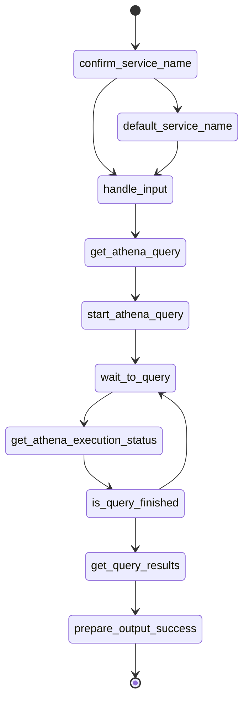

```mermaid
stateDiagram-v2
  state_1: confirm_service_name
  state_2: default_service_name
  state_3: handle_input
  state_4: get_athena_query
  state_5: start_athena_query
  state_6: wait_to_query
  state_7: get_athena_execution_status
  state_8: is_query_finished
  state_9: get_query_results
  state_10: prepare_output_success

  [*] --> state_1
  state_1 --> state_3
  state_1 --> state_2
  state_2 --> state_3
  state_3 --> state_4
  state_4 --> state_5
  state_5 --> state_6
  state_6 --> state_7
  state_7 --> state_8
  state_8 --> state_6
  state_8 --> state_9
  state_9 --> state_10
  state_10 --> [*]
```
