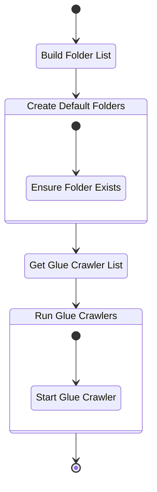

```mermaid
stateDiagram-v2
  state_1: Build Folder List
  state_2: Create Default Folders
  state_2_1: Ensure Folder Exists
  state_3: Get Glue Crawler List
  state_4: Run Glue Crawlers
  state_4_1: Start Glue Crawler

  state state_2 {
    [*] --> state_2_1
  }
  state state_4 {
    [*] --> state_4_1
  }
  [*] --> state_1
  state_1 --> state_2
  state_2 --> state_3
  state_3 --> state_4
  state_4 --> [*]
```
