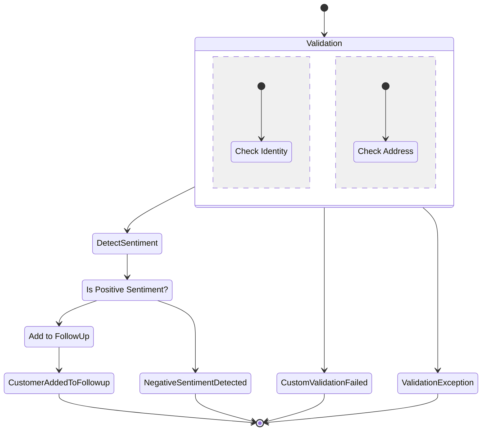

```mermaid
stateDiagram-v2
  state_1: Validation
  state_1_0_1: Check Identity
  state_1_1_1: Check Address
  state_2: DetectSentiment
  state_3: ValidationException
  state_4: Is Positive Sentiment?
  state_5: NegativeSentimentDetected
  state_6: CustomValidationFailed
  state_7: Add to FollowUp
  state_8: CustomerAddedToFollowup

  state state_1 {
    [*] --> state_1_0_1
    --
    [*] --> state_1_1_1
  }
  [*] --> state_1
  state_1 --> state_2
  state_1 --> state_6
  state_1 --> state_3
  state_2 --> state_4
  state_4 --> state_7
  state_4 --> state_5
  state_7 --> state_8
  state_3 --> [*]
  state_5 --> [*]
  state_6 --> [*]
  state_8 --> [*]
```
